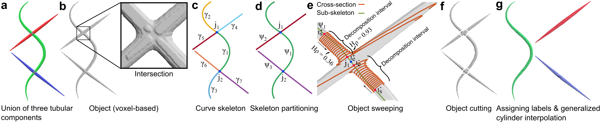

# Cylindrical Shape Decomposition

We develop the cylindrical shape decomposition (CSD) algorithm to decompose an object, a union of several tubular structures, into its semantic components. We decompose the object using its curve skeleton and translational sweeps. CSD partitions the object curve skeleton into maximal-length sub-skeletons over an orientation cost, each sub-skeleton corresponds to a semantic component. To find the intersection of the tubular components, CSD translationally sweeps the object in decomposition intervals to identify critical points at which the object's shape changes substantially. CSD cuts the object at critical points and assigns the same label to parts along the same sub-skeleton, thereby constructing a semantic component. CSD further reconstructs the semantic components between parts using generalized cylinders.

If you use any part of the cylindrical shape decomposition algorithm in your research, please cite:

Abdollahzadeh, A., Sierra, A. & Tohka, J. Cylindrical Shape Decomposition for 3D Segmentation of Tubular Objects. IEEE Access 9, 23979–23995 (2021).

The outline of the CSD algorithm:

If you had the "RuntimeError: Negative discriminant in time marcher quadratic" error in the skeletonization, you may install an older version of skfmm, e.g., 0.0.8.
